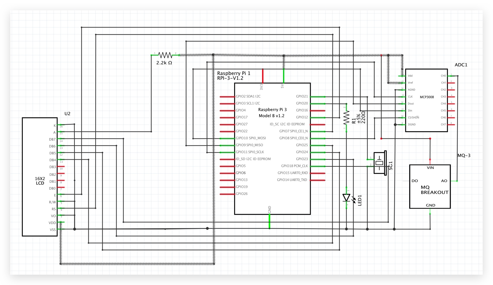

## 说明文档
#### 项目介绍     
该项目使用树莓派3B+ + MQ-3传感器 制作的酒精浓度传感器，当检测到酒精浓度是会在LCD显示器上显示酒精浓度，当浓度超过设置的阈值是LED闪烁，蜂鸣器蜂鸣。

#### 项目原理图


#### 项目使用的库
1. MQ-3酒精浓度检测使用库```https://github.com/tutRPi/Raspberry-Pi-Gas-Sensor-MQ```
2. 该库检测浓度单位为**ppm**，需转成**mg/m3**，参考公式来源：```https://blog.csdn.net/zhuisaozhang1292/article/details/84983874```
3. LCD操作库```https://www.basemu.com/16x2-lcd-module-control-using-python-and-rpi.html```

#### 引脚连接
|   PI    |   LCD   | 
|  -----  |   ---:  |
|    06   |    01   |
|    02   |    02   |
|    06   |    03   |
|    26   |    04   |
|    06   |    05   |
|    32   |    06   |
|    22   |    11   |
|    18   |    12   |
|    16   |    13   |
|    12   |    14   |
|    02   |    15   |
|    06   |    16   |

|   PI    | MCP3008 | 
|  -----  |   ---:  |
|    02   |    VDD  |
|    02   |    VREF |
|    06   |    AGND |
|    23   |    CLK  |
|    21   |    DO   |
|    19   |    DIN  |
|    24   |    CS   |
|    06   |    DGND |

